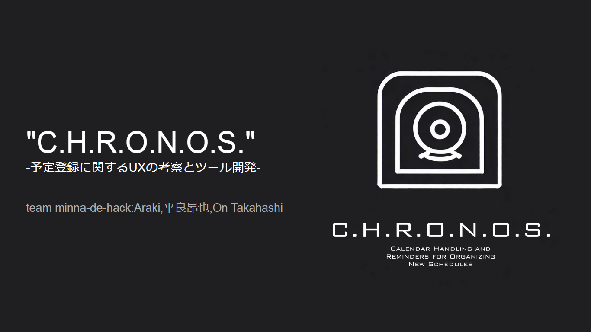
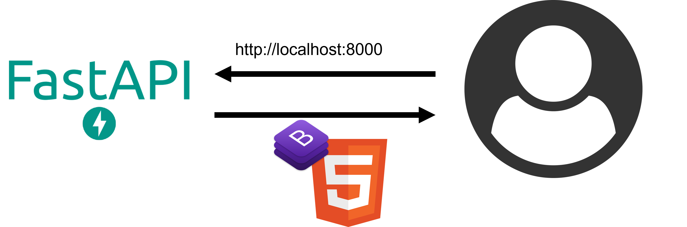

# C.H.R.O.N.O.S
Date : 2023/05/20 ~ 2023/05/21

5月Vol.3ハッカソン技育CAMP2023のminna-de-hackというチームで開発

## アプリ
このアプリは、「予定の管理」をテーマにした...

**「C.H.R.O.N.O.S」という予定管理アプリ**です。

## スライド


スライドURL：https://docs.google.com/presentation/d/1EwOeLtc1N9vt-CfKd4iLYpIMM__QZWcTUPl9fHgCmMg/edit

## 技術要素スタック
### 技術要素


## 技術的な挑戦
- (出来なかったけれど)AWS Elastic Beanstalkを使ってデプロイしようとした。

## 機能
このアプリを一言で言うと

**予定の自動登録ボタンの埋め込み用のコードを自動生成するツール**です。

これを使うと、
「サイト利用者がイベント登録後にGoogleカレンダーに予定を追加する作業が省けるHTML」を取得することができます。

取得するHTMLは、例えば以下のようになります。

```HTML
<iframe id="embedded-schedule" scrolling="no" style="border:0" src="http://127.0.0.1:8000/api?title=EventTitle&description=some+description&dates=20230520T110000%2F20230521T150000" onload="loadInframe()">
```

## 利用方法
1. リポジトリをクローンする
   ```
   git clone https://github.com/minna-de-hack/schedule-api.git
   ```
2. pythonのライブラリをインストールする
    ```
    pip install -r requirements.txt
    ```

3. プログラムを実行する
    ```
    uvicorn application:app --reload
    ```
